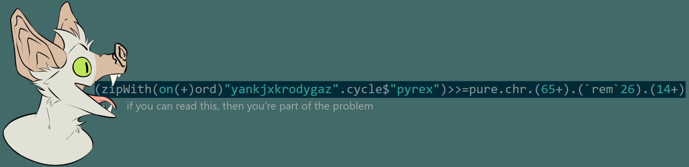

# Hey, it's Nyeogmi!

(art by Grizzly_Bjorn on Twitter.)

Hey! I'm a programmer from the US. I've written code for a bunch of real-life stuff, some of which you might have even used.

My favorite stack is PYREX -- (Python+Redis+nginx) -- which conveniently is the name of my secondary fursona.

[How I write services](how_i_write_services.md)
